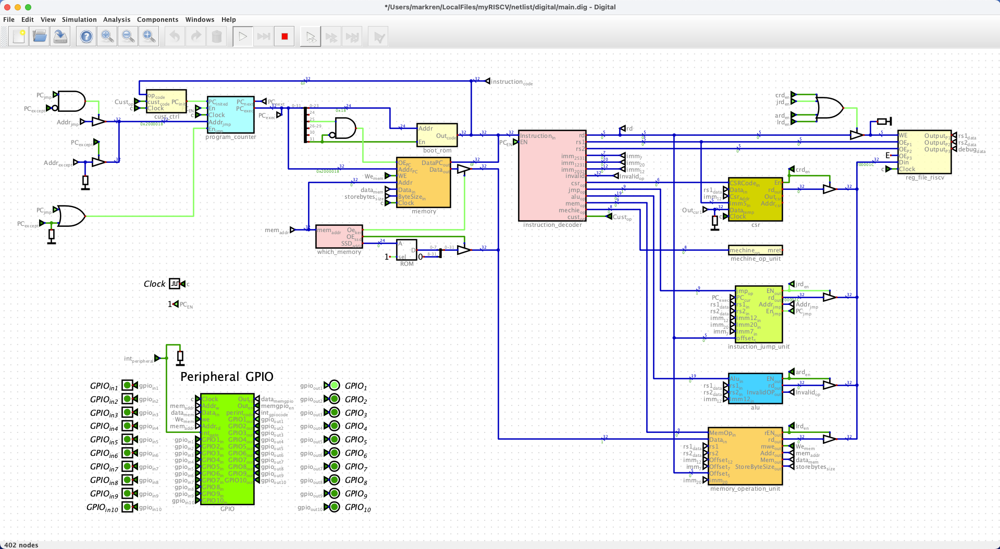
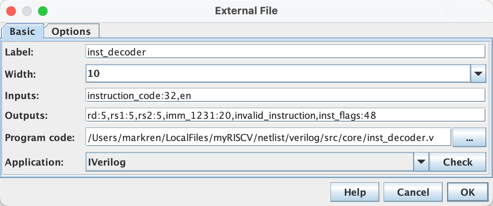

## Project Description

This is a personal project starts at Jan 14th, 2025, aiming to build a CPU in RISC-V architecture. The persuit of this project is to create a beginner-friendly way of self-learning how a computer (or a micro-controller) works. The creation of this project heavily referenced [riscv-mcu](https://github.com/renyangang/riscv-mcu/tree/master) repository. The objective of this project is to **physically** build a RISCV CPU from scratch, i.e. we are going to use logic gates, simulation tools like VHDL, search for suitable chips, draw PCBs, etc. Hopefully it has peripherals like IIC, GPIOs, UART, etc. Running early versions of linux on it will be even better! 

**Progress:**


## Learning Trajactory

Check out [doc](./doc/README.md) (not yet finished).

## See Our Work So-far

### Install the RV32GC toolchain on MacOS

Follow the instructions on this open-source [riscv-gnu-toolchain](https://github.com/riscv-collab/riscv-gnu-toolchain). Specifically on MacOS M2 chip, cd into a folder, then (make sure you have installed `brew`):

```bash
git clone https://github.com/riscv/riscv-gnu-toolchain
brew install python3 gawk gnu-sed make gmp mpfr libmpc isl zlib expat texinfo flock libslirp
./configure --prefix=/opt/riscv --with-arch=rv32gc --with-abi=ilp32d --disable-gdb
sudo gmake
```

It will took roughly 1 hour to finish the compilation. If you do not include the `--disable-gdb` flag, you will get the following error at the end of compilation, just ignore it since we don't use `GDB` tool for now.

```bash
configure: error: Building GDB requires GMP 4.2+, and MPFR 3.1.0+.
Try the --with-gmp and/or --with-mpfr options to specify
their locations.  If you obtained GMP and/or MPFR from a vendor
distribution package, make sure that you have installed both the libraries
and the header files.  They may be located in separate packages.
gmake: *** [Makefile:628: stamps/build-gdb-newlib] Error 1
```

Then add the CLI to `system path` (temperarily):

```bash
export PATH=$PATH:/opt/riscv/bin
```

Check if the tools have correctly added:

```bash
riscv32-unknown-elf-gcc --version
riscv32-unknown-elf-as --version
riscv32-unknown-elf-ld --version
riscv32-unknown-elf-objdump --version
riscv32-unknown-elf-objcopy --version
```

### Install `ghdl` toolchain on MacOS

See [here](https://marcobisky.github.io/p/rtl-analysis-on-macos-under-300mb/) for installing the `ghdl` toolchain on MacOS.

### Simulation in VHDL

Use `Digital` to open `./netlist/digital/main.dig`, you can directly run simulation here. Or you can export the VHDL description of `main.dig` in `./netlist/vhdl` folder, then run:

```bash
cd netlist/vhdl/
python3 split.py
make run CIRCUIT=main
```

Since `Digital` export all VHDL description for all submodules in one file, one need `split.py` to split them into different files in `./netlist/vhdl/src/` folder. At the same time, `split.py` will also generate the `Makefile` in the currect folder for using `ghdl` to compile. If you want to simulate other modules (other than `main.vhdl`), just write a testbench file in `./netlist/vhdl/tb/` folder and run:

```bash
make run CIRCUIT=<your_module>
```

You can run

```bash
make help
```

to see how to use it.

### Use `Digital` for Visual Simulation

```bash
cd netlist/src/
make
make hex
```

This will generate `./objs/` and a bunch of `.hex` files in the current folder. Load them into the boot rom and ROM in `./digital/main.dig` respectively and run simulation:



### `Digital` + Verilog Plan (recommended)

For those of you familiar with `verilog`, but think that simulating the whole circuit using testbenches is not very visual. I recommend you write each block in `verilog`, then use `External File` block and link to the `.v` file in the path. Don't forget to change the iverilog path in the settings to something like:

```bash
/opt/homebrew/Cellar/icarus-verilog/12.0/bin/iverilog
```

and the iverilog options to:

```bash
-I /path/to/the/files/to/include
```

There is a bug in `Digital` though, you may need to modify the code so that the inputs and outputs are correctly filled in first, then click `Check`.



---

Get in touch: **Jinming Ren** (3191293752@qq.com)