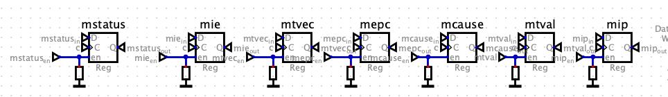

## Introduction

* CSR (Control and Status Registers)
* Are accessed using CSR instructions, not via memory-mapped I/O like GPIO registers.

## Commonly Used CSRs



1.	`mstatus`: Controls global interrupt enable and privilege modes.
2.	`mie`: Enables specific interrupts.
3.	`mtvec`: Specifies where the CPU jumps on an interrupt/exception.
4.	`mepc`: Saves the address of the interrupted instruction.
5.	`mcause`: Identifies the cause of the interrupt/exception.
6.	`mtval`: Provides extra information about exceptions.
7.	`mip`: Indicates which interrupts are pending.

## Commonly Used CSR instructions

```assembly
;register version:
csrrw x5, mstatus, x10  ;x5 = mstatus (read), mstatus = x10 (write)
csrrs x5, mie, x10      ;x5 = mie (read), mie |= x10 (set)
csrrc x5, mie, x10      ;x5 = mie (read), mie &= x10 (clear)

;imm version:
csrrwi x5, mstatus, 0x1 ;x5 = mstatus (read), mstatus = 0x1 (write imm)
csrrsi x5, mie, 0x1     ;x5 = mie (read), mie |= 0x1 (set imm)
csrrc x5, mie, 0x1      ;x5 = mie (read), mie &= 0x1 (clear imm)
```