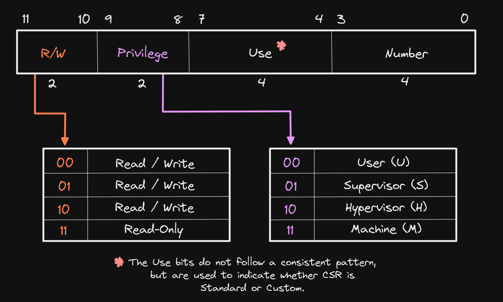

## Introduction

* CSR (Control and Status Registers)
* Are accessed using CSR instructions, not via memory-mapped I/O like GPIO registers.
* GPRs can be accessed at any privilege level, while CSRs are defined at a specific privilege level and can only be accessed by that level and any levels of higher privilege.
* Every CSR has a unique address, each 32 bits share one address (instead of 8 bits).
* CSR addresses are 12-bits, meaning that up to 4,096 CSRs can be implemented ($2^12 = 4096$). The bits in a CSR address define its accessibility, use, and CSR number.


* While GPRs are used for storing data used to perform operations, CSRs typically modify the behavior of a hart (i.e. “Control”) or inform of its state and attributes (i.e. “Status”), or both.

* `WARL` (Write any, read legal): Some field in a CPU register that allows **any** value to be **written**, but when **read** back, it returns only a **valid (legal)** value. For example, in `MPP[12:11]` field in `mstatus` register, we have:

| Write Attempt (MPP) | Stored Value (MPP field) |
|---------------------|--------------------------|
| 00 (User)           | ✅ 00 (User mode)        |
| 11 (Machine)        | ✅ 11 (Machine mode)     |
| 01 (Illegal)        | 🔄 Returns 00 or 11 (Legal) |
| 10 (Illegal)        | 🔄 Returns 00 or 11 (Legal) |

* CSRs related intimitely to interrupts and exceptions (interrupts are external ("asynchronise"), exceptions are internal ("synchronise", usually through software or timer), some place confuse them though, but it's okay).

## Commonly Used CSRs and their sub-fields

### Machine Mode

The registers are labelled in this format: `reg (addr, reset_val)`.


1. `mstatus (0x300, 0x00001800)`: Machine Status (lower 32 bits), controls global interrupt enable and privilege modes.

- `mstatus.MPP[12:11]`: Machine Previous Priviledge mode. When an mret is executed, the privilege mode is change to this value.
- `mstatus.MIE[3]`: Machine (*global*) Interrupt Enable.
- `mstatus.MPIE[7]`: Machine previous Interrupt Enable. When an interrupt occurs, the content in `mstatus.MIE` is loaded into this bit (and for simplicity, `mstatus.MIE` is changed to 0, so no other interrupts is allowed to come in), and after the interrupt is processed (after `mret`), this bit is restored into `mstatus.MIE` again.

2. `misa (0x301, depends on RV32 and M_EXT)`: 

3.	`mie (0x304, 0x00000000)`: Machine Interrupt Enable, enables *specific* interrupts (not *global*). Also you should have a look at `mip (0x344)`.

4.	`mip (0x344)`: Machine Interrupt Pending Register, indicates which *specific* interrupts are pending.


    - `MSIP/MSIE[3]`: Machine Software Interrupt Pending/Enable
    - `MTIP/MTIE[7]`: Machine Timer Interrupt Pending/Enable
    - `MEIP/MEIE[11]`: Machine External Interrupt Pending/Enable

5.	`mtvec (0x305, )`: Machine Trap-Handler Base Address, specifies where the CPU jumps on an interrupt/exception.


    - `MODE[1:0]`: 
        - 00: Direct. All traps (either interrupts or exceptions) set `PC` *directly* to `BASE`.
        - 01: Vectored. Exceptions will set `PC` *directly* to `BASE`, while (asynchronous) interrupts will set `PC` to `BASE`+4*`mcause.Exception Code` (See `mcause` register.)
        - others: invalid.

6.	`mepc (0x341, 0x00000000)`: Machine Exception Program Counter, saves the address of the interrupted instruction. 
    - When an interrupt occurs, the current PC + 1 is saved in `mepc`.
    - When an exception is encountered, the current PC is saved in `mepc`. (Why? The exception may triggered by the instruction at the current PC, maybe we solve the exception in the interrupt handler, so give it another chance to execute that instruction again.)
    
    and the core jumps to the exception address. When a `mret` instruction is executed, the value from `mepc` replaces the current program counter. 

7.	`mcause (0x342)`: Machine Trap Cause, identifies the cause of the interrupt/exception.


    - `Interrupt[31]`: 
        - 1: Exceptions
        - 0: Interrupts
    - `Exception Code[30:0]`: (pay special attention to the number 3/7/11)

        | `Interrupt[31]` | `Exception Code[30:0]`       | Description                        |
        |-----------|----------------------|------------------------------------|
        | 1         | 0, 2, 4, 6, 8, 10, 12, 14-15  | *Reserved* |
        | 1         | 1 / 3                | Supervisor/Machine software interrupt  |
        | 1         | 5 / 7                | Supervisor/Machine timer interrupt    |
        | 1         | 9 / 11               | Supervisor/Machine external interrupt |
        | 1         | 13                   | Counter-overflow interrupt        |
        | 1         | ≥16                  | *Designated for platform use*     |
        | 0         | 0                     | Instruction address misaligned    |
        | 0         | 1                     | Instruction access fault          |
        | 0         | 2                     | Illegal instruction               |
        | 0         | 3                     | Breakpoint                        |
        | 0         | 4                     | Load address misaligned           |
        | 0         | 5                     | Load access fault                 |
        | 0         | 6 / 7                 | Store/AMO address/access fault    |
        | 0         | 8 / 9 / 11            | Environment call from U/S/M-mode  |
        | 0         | 10, 14, 17, 20-23, 32-47, ≥64 | *Reserved* |
        | 0         | 12                    | Instruction page fault            |
        | 0         | 13                    | Load page fault                   |
        | 0         | 15                    | Store/AMO page fault              |
        | 0         | 16                    | Double trap                       |
        | 0         | 18                    | Software check                    |
        | 0         | 19                    | Hardware error                    |
        | 0         | 24-31, 48-63           | *Designated for custom use*       |

8.	`mtval (0x343)`: Machine Trap Value, provides extra information about exceptions (their addresses and so on)


## Commonly Used CSR instructions

```assembly
;register version:
csrrw x5, mstatus, x10  ;x5 = mstatus (read), mstatus = x10 (write)
csrw mtvec, t0          ;mtvec = t0 (write only)
csrrs x5, mie, x10      ;x5 = mie (read), mie |= x10 (set)
csrrc x5, mie, x10      ;x5 = mie (read), mie &= x10 (clear)

;imm version:
csrrwi x5, mstatus, 0x1 ;x5 = mstatus (read), mstatus = 0x1 (write imm)
csrrsi x5, mie, 0x1     ;x5 = mie (read), mie |= 0x1 (set imm)
csrrc x5, mie, 0x1      ;x5 = mie (read), mie &= 0x1 (clear imm)
```

Convenient pseudo-instructions:

```assembly
csrr rd, csr    ;csrrs rd, csr, x0
csrw csr, rs    ;csrrw x0, csr, rs
csrs csr, rs    ;csrrs x0, csr, rs
csrc csr, rs    ;csrrc x0, csr, rs
csrwi csr, imm  ;csrrwi x0, csr, imm
csrsi csr, imm  ;csrrsi x0, csr, imm
csrci csr, imm  ;csrrci x0, csr, imm
```