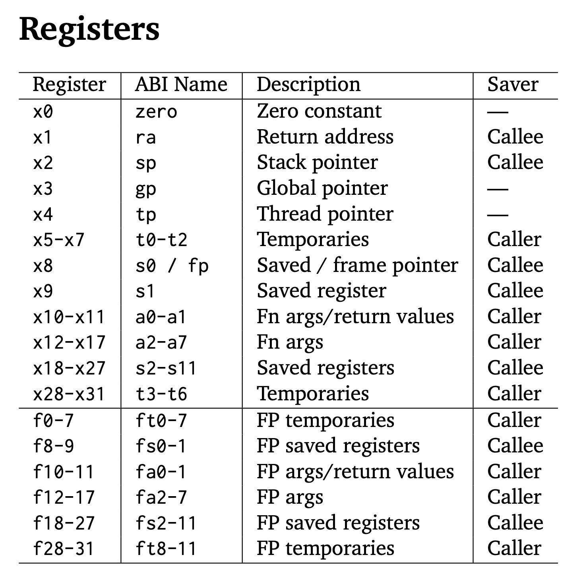

## Introduction

The 32 registers in RISC-V are called general-purpose registers (GPRs, or "integer registers"). They are used for various purposes, such as holding data, addresses, or temporary values during program execution. These registers are 32 bits wide in the RV32I ISA and are identified as x0 to x31.

Each register has a conventional name that indicates its intended usage, although these names are just conventions, and you can use them for other purposes if needed.



## Partial Explanations

### `ra`

Purpose: Stores the return address for function calls.

```assembly
jal ra, function_label  # Jump to function_label and store return address in ra
ret                     # Return to the address in ra
```

### `sp`

Purpose: Points to the top of the stack (used for dynamic memory allocation during function calls).

```assembly
addi sp, sp, -16      # Allocate 16 bytes on the stack
sw t0, 0(sp)          # Store t0 at the top of the stack
lw t0, 0(sp)          # Retrieve t0 from the stack
addi sp, sp, 16       # Deallocate 16 bytes
```

### `gp`

Purpose: Points to global and static data in memory.

```assembly
lw t0, 0(gp)         # Load a value from the global data section
```

### `tp`

Purpose: Points to thread-local storage (used in multi-threaded programs).

```assembly
lw t0, 0(tp)         # Load a thread-specific value
```

### `t0-t6`

Purpose: Temporary values, not preserved across function calls.

