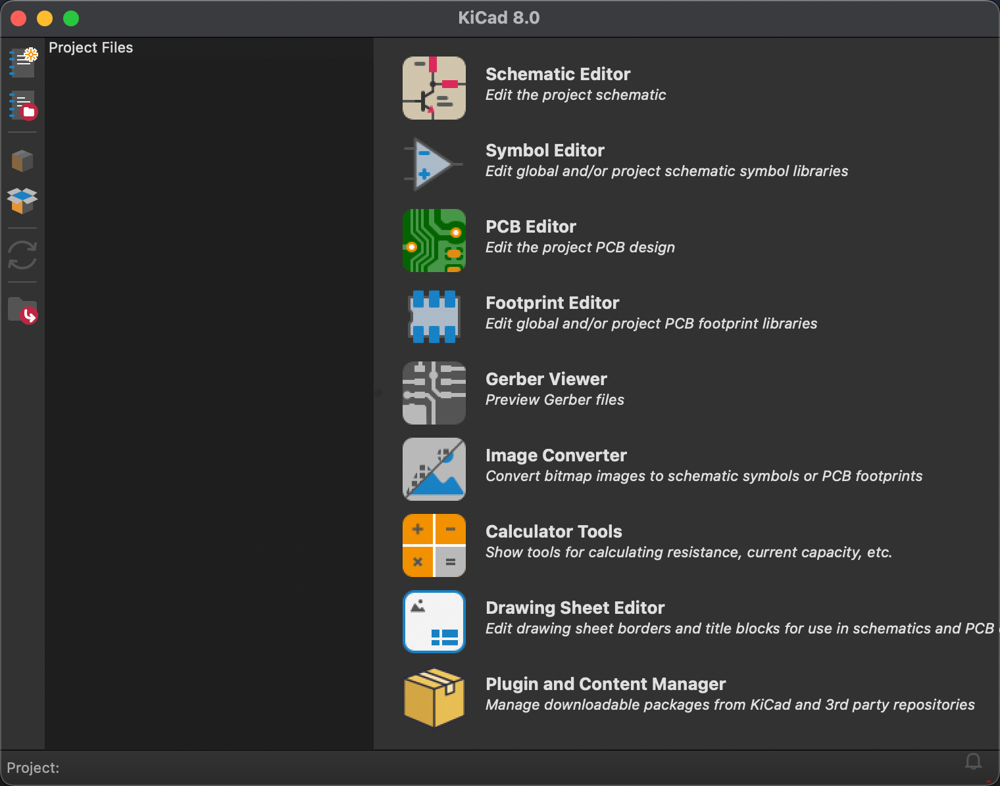

## Introduction

This is the learning path of how I learned to design PCB in Kicad from no prior knowledge. (Some of the contents are GPT-aided)

## What is PCB designing?

After you finished designed (and simulated) your target circuit in `Digital` (or in Vivado), you may want to actually build the circuit instead of just simulating or build them with a breadboard. So you need to choose what type of existing multiplexers, resistors to choose (you do not want to build the board from sand!)

## Steps

Schematic Editor -> PCB Editor -> Gerber Viewer

1.	画原理图（Schematic），定义电路连接关系。
2.	设计 PCB 板，安排元器件位置，并布线。
3.	生成 制造文件（Gerber 文件），用于生产 PCB。
4.	交给工厂制造，最终焊接电子元件，组装完整电路。

## Modules in Kicad

1. 原理图编辑器（Schematic Editor, step 1）: Just defines the connection of the targeted circuit using generalized (not specific) components.

2. 符号编辑器（Symbol Editor, optional）: If there is no existing component in the library, you will need to draw one in this editor.

3. PCB 编辑器（PCB Editor, step 2）: Design the layout of the final physical board, including the size of the hole, number of layers, etc.

4. 封装编辑器（Footprint Editor, optional）: If there is no factorical component footprint, create one here.

5. Gerber 查看器（Gerber Viewer, step 3）: Give this to the manufactuer to print your board out.

6. 图片转换工具（Image Converter, optional）: If you want to add a logo on the board.

7. 计算工具（Calculator Tools, optional）: Help you calculate some parameters , for example, different wire width are required for different current amount.

8. 绘图编辑器（Drawing Sheet Editor, optional）: Beautify your board.

9. 插件与内容管理器（Plugin and Content Manager, optional）: Install add-ins here.